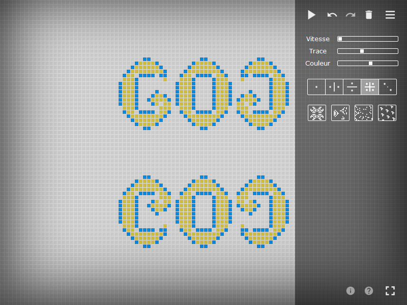
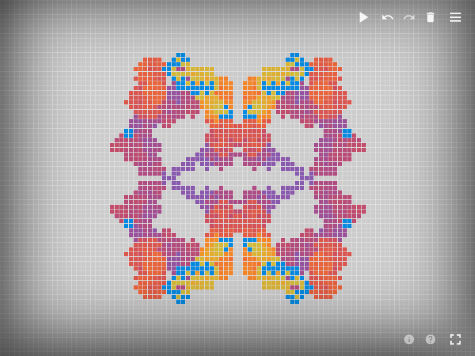

Game of Grid
============

[Game of Grid](http://gameofgrid.com "gameofgrid.com") is a graphics game freely inspired from [Conway's game of life](https://en.wikipedia.org/wiki/Conway%27s_Game_of_Life "Conway's game of life on wikipedia"). Each drawing you draw gives birth to a unique animation.

Go to [gameofgrid.com](http://gameofgrid.com) to play with it.

 | 
:-------------------------:|:-------------------------:

Game of Grid is an open source project created by Félicien Brochu. Any contribution is welcome.

[Donate](https://www.paypal.com/cgi-bin/webscr?cmd=_donations&business=contact%40gameofgrid%2ecom&lc=FR&item_name=gameofgrid%2ecom&no_note=1&no_shipping=1&rm=1&return=http%3a%2f%2fgameofgrid%2ecom&cancel_return=http%3a%2f%2fgameofgrid%2ecom&currency_code=EUR&bn=PP%2dDonationsBF%3abtn_donate_SM%2egif%3aNonHosted) to support this project.

contact: [contact@gameofgrid.com](mailto:contact@gameofgrid.com)